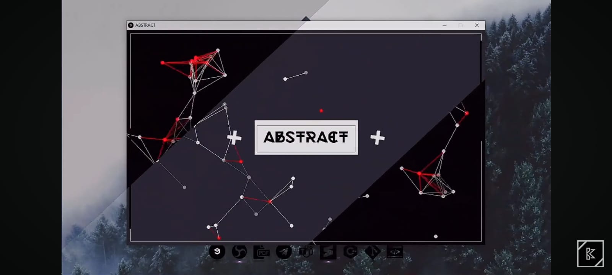

#  Proyecto de Aprendizaje con SDL2 y C++
Este repositorio presenta un avance en el estudio y uso de SDL2 junto con sus herramientas, con el objetivo de continuar el aprendizaje en C++ y desarrollar más proyectos en el futuro. En esta ocasión, el proyecto se centra en un detector de puntos que representan líneas.

#  Descripción del Proyecto
En este proyecto se implementa un algoritmo que detecta puntos y los conecta para formar líneas basadas en la proximidad entre estos puntos. Cada punto realizará una traslación aleatoria, lo que genera un movimiento dinámico y continuo en la visualización de las líneas conectadas.

#  Características Principales:
-Detección de Puntos: El algoritmo identifica puntos en un espacio bidimensional.
-Conexión de Puntos: Los puntos se conectan para formar líneas basadas en su proximidad.
-Traslación Aleatoria: Cada punto realiza una traslación aleatoria, lo que crea un efecto de movimiento constante.
-Uso de SDL2: La biblioteca SDL2 se utiliza para la representación gráfica y manejo de eventos.

# Objetivo
El objetivo principal de este proyecto es profundizar en el uso de SDL2 y mejorar las habilidades en programación con C++. A través de este proyecto, se pretende explorar conceptos de animación, detección de proximidad y manejo de gráficos en tiempo real.

#  Requisitos
Para ejecutar este proyecto, se necesitan los siguientes requisitos:

C++ compilador (GCC, Clang, MSVC, etc.)
SDL2 Library
Compilación y Ejecución
Clona el repositorio y dirigete a la carpeta del proyecto:

***cd LINES_CONNECTED/

Compila el proyecto:
***make bin

Ejecuta el programa:
./bin/Application.exe
